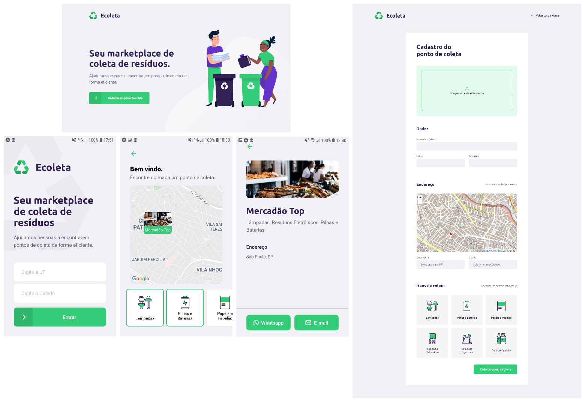

Projeto desenvolvido na semana Next Level Week 1.0 da Rocketseat.

## Sobre o projeto

O Ecoleta é um marketplace que ajuda pessoas a encontrarem pontos de coleta de resíduos de forma eficiente.

## API

Para executar a API siga as instruções do arquivo [README.md](https://github.com/DouglasVarollo/NLW1/blob/master/server/README.md) que está na pasta **server**.

## Web

Para executar a aplicação web siga as instruções do arquivo [README.md](https://github.com/douglasVarollo/NLW1/blob/master/web/README.md) que está na pasta **web**.

## Mobile

Para executar a aplicação mobile siga as instruções do arquivo [README.md](https://github.com/DouglasVarollo/NLW1/blob/master/mobile/README.md) que está na pasta **mobile**.

